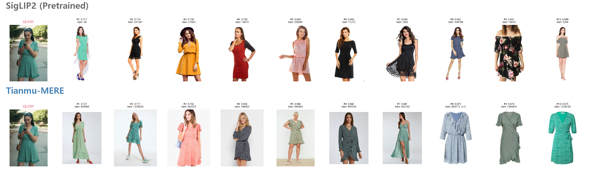
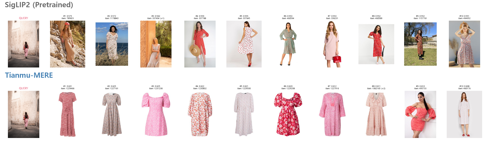
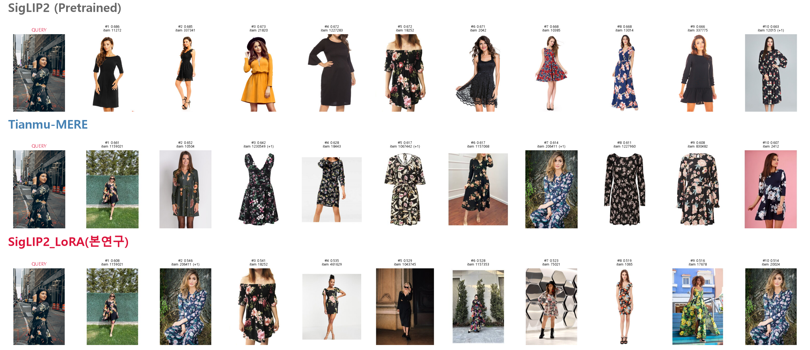
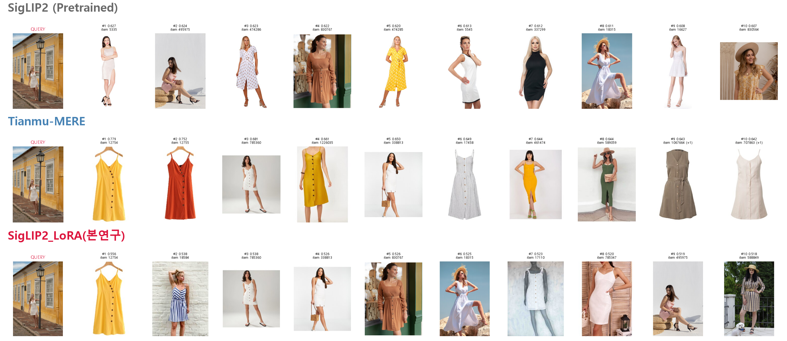
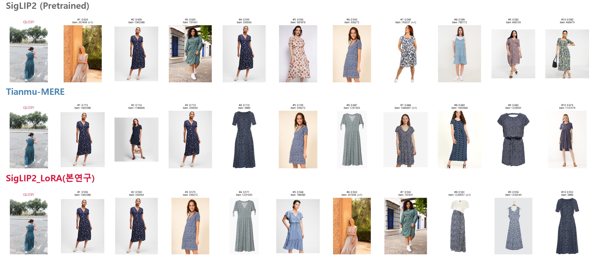

# Revit Product Engineer (Vision) 과제 — 결과 보고서

# 1. 평가 체계 수립

Baseline으로는 SigLIP2 so400m/patch14-384와 Tianmu-MERE를 사용하였다. 두 모델의 vision encoder
백본이 동일하기 때문이다.

평가는 세 가지 방식으로 진행하였다.

이에 앞서, 보다 정확한 평가를 위하여 image_id와 픽셀 단위 diff를 이용해 중복 이미지를 최대한 먼저
제거하였다.

### (1) MPR (Mean Percentile Rank)

GLAMI-1M의 test split에 제공된 top_1_sim 샘플을 정답으로 사용하였다. train split을 갤러리로, test
샘플을 쿼리로 검색하였을 때, top_1_sim 샘플이 갤러리 내에서 상위 몇 %로 랭크되는지를 산출하고, 이를
평균한 값을 지표로 삼았다.

test split을 dresses 카테고리로 필터링한 후, top_1_sim 매칭 이미지가 실제로 dresses 카탈로그 내부에
존재하는(자기 자신과의 매칭은 제외) 경우는 총 2,448건이었다. 이 중 동일한 쿼리 이미지를 공유하는
중복을 제거하여 1,744건으로, 근접중복(픽셀 diff < 5) 이미지를 추가로 제거하여 최종 **1,581쌍**을
확정하였다.

Top-10을 평가 지표로 사용하기에는, 갤러리 내에 top_1_sim 샘플 외에도 유사한 이미지가 다수 존재할 수
있어 평가의 불확실성이 크다고 판단하였다. 즉 이 지표는 Top-K 내에 가장 유사한 항목이 포함되는지를
평가하기에는 한계가 있으나, 유사한 원피스를 실제로 유사하게 임베딩하는지를 평가하는 지표로는 활용할 수
있었다.

### (2) 색상 일치율 (평균 일치 비율)

색상은 원피스 유사성 판단에서 가장 중요한 특징 중 하나이므로, 검색 결과가 쿼리와 실제로 같은 색상인지를
별도의 정량 지표로 측정하였다. GLAMI-1M 카탈로그는 13개 국가(geo)의 다국어 상품명으로 구성되어 있어,
언어별 색상 단어 사전(12개 canonical 색상: black/white/blue/green/red/pink/gray/beige/brown/yellow/
purple/orange)을 구성하여 상품명에서 색상을 추출하였다. 전체 카탈로그 32,434개 중 46.7%(15,152개)에서
색상이 검출되었다.

MPR과 동일한 1,581쌍 중, 쿼리(test) 아이템의 이름에서 색상이 검출된 **887쌍**을 대상으로 평가하였다.
지표는 Top-K 검색 결과 중 색상이 검출된 항목들 가운데 쿼리와 실제로 같은 색상인 비율의 평균("평균
일치 비율")으로 정의하였다.

### (3) Top-10 정성평가

앞선 지표들의 한계점인 Top-10 퀄리티를 평가하기 위하여 진행하였으며, 제공된 외부 쿼리 100장으로
수행하였다.

---

# 2. 베이스라인 분석

### 2.1 정량 비교

| 모델 | Mean Percentile Rank |
|---|---|
| 사전학습 SigLIP2 | 0.9754 |
| Tianmu-MERE | 0.9779 |

이 지표를 비교하면 Tianmu-MERE가 근소하게 우세하나, 두 모델 모두 비슷한 원피스 이미지를 비슷하게
임베딩하는 성능은 갖추고 있는 상태로 판단된다.

### 2.2 정성 비교

정량 비교에서 드러나지 않는 차이를 확인하기 위해 외부쿼리 100장에 대한 Top-10 검색 결과를 직접
비교하였다. Tianmu-MERE는 배경 및 인물에 invariant하게 원피스 상품 자체의 invariant한 특징을 잘
포착하고 있다고 판단되는 지점이 두 가지 있었다.

1. SigLIP2에 비해 원피스의 문양(패턴)에 대한 표현을 더 잘한다.

   

2. SigLIP2는 인물사진 쿼리에 대해 Top-10이 거의 대부분 인물사진으로 채워지는 반면, Tianmu-MERE는
   인물사진 쿼리에서도 원피스 단독 상품 사진이 검색 상위에 함께 등장한다.

   

---

# 3. 개선 가설 수립

정량·정성 비교를 종합하면, Tianmu-MERE가 SigLIP2보다 원피스 자체의 특징을 잘 추출하며, 특히
배경·인물에 invariant한 특징을 잘 뽑아낸다고 판단하였다.

이를 개선하기 위해서는 원피스의 local 특징을 잘 이해하는 feature를 학습해야 한다고 보았다.
이를 위해 global-local self-distillation과 contrastive learning을 결합한 학습 방식을 설계하였다.

모델 아키텍처는 한정된 하드웨어(8GB VRAM) 환경에서도 효율적으로 학습할 수 있도록 LoRA로 설계하였다.

---

# 4. SigLIP2 Fine-tuning

### 데이터 전처리

정량평가에 최대한 누수가 없도록, 중복을 제거한 train split에서 학습 데이터를 추출하여 사용하였다.
GPU 및 시간 자원의 한계로, 본 연구는 100 step 내외로만 진행하였다.

### 모델 아키텍처 및 학습 방식

모델 아키텍처는 pretrained SigLIP2에 LoRA를 적용한 형태이며, 학습 방식은 self-supervised 학습을
기반으로 self-distillation과 contrastive learning을 결합하여 진행하였다.

### 최종 채택한 연구

- **teacher-student 구조**: teacher는 clean(무증강) 이미지를 인코딩하고, 가중치는 backprop 없이
  student의 EMA(지수이동평균)로 갱신된다(momentum=0.99). student는 LoRA를 학습하며 augmented view를
  인코딩한다.
- **view 구성**: student의 view를 global 2개(zoom-out 1개 + 일반 crop 1개, 고정)와 local 4개
  (local-crop만 반복 샘플링)로 역할을 고정하였다.
- **손실함수**: anchor_loss는 6개 view 전체에 대해 teacher와의 (1 - cosine similarity) 평균으로,
  infonce_loss는 6개 view의 모든 쌍(15쌍)에 대한 대조학습 손실의 평균으로 계산하였다. InfoNCE에는
  배치 내 다른 이미지 중 teacher 임베딩 기준 유사도가 높은 항목을 false negative로 마스킹하는 처리를
  포함하였다.
- batch size는 16으로 유지하였다(대조학습의 negative pool을 보존하기 위함).

---

# 5. 세 모델의 최종 비교

### 정량 비교

| 모델 | R@10 | Mean Percentile Rank |
|---|---|---|
| 사전학습 SigLIP2 | 0.402 | 0.9754 |
| Tianmu-MERE | 0.367 | 0.9779 |
| **본 연구 (최종 모델)** | **0.464** | **0.9889** |

R@10은 검색 대상 갤러리에 top_1_sim 샘플 이외에도 유사한 이미지가 다수 존재할 수 있어, 완전히 신뢰할
수 있는 지표는 아니다.

**색상 일치율 (평균 일치 비율)** — 쿼리 색상이 검출된 887쌍 대상, Top-K 결과 중 색상이 검출된 항목
가운데 쿼리와 같은 색상인 비율의 평균:

| 모델 | Top-1 | Top-5 | Top-10 |
|---|---|---|---|
| 사전학습 SigLIP2 | 51.9% | 49.6% | 47.3% |
| Tianmu-MERE | 55.2% | 52.7% | 52.3% |
| **본 연구 (최종 모델)** | **63.9%** | **61.1%** | **59.4%** |

---

# 6. 주요 Top 10 사례 및 결과 해석

### 주요 Top 10 사례

처음에 언급했던 사전학습 SigLIP2의 단점이었던 의류 패턴에 대한 인식이, 본 연구를 통해 유의미하게
개선되었다.

디테일 포착이 좋아진 예 — 옷의 무늬 패턴을 인식함:

디테일 포착이 좋아진 예 — 중앙 단추 디테일:

또한 인물사진 쿼리에 대해 의류 단독 이미지가 검색되는 케이스가 발생하였다. Tianmu-MERE보다는 그
정도가 떨어지지만, 사전학습 SigLIP2보다는 배경·인물에 대한 invariant 성능이 조금은 향상된 것으로
판단된다.

인물사진 쿼리 결과에 단일 원피스 사진이 검색되기 시작한 예:

### 결과 해석

SigLIP2를 fine-tuning하여, 기존 분석에서 보였던 pretrained 모델의 한계점이 개선되는 것을 확인하였다.
정량적으로는 본 연구가 baseline 2종보다 MPR이 소폭 향상되었고, 색상 일치율은 유의미하게 향상되어
Tianmu-MERE보다 본 연구가 우세하였다. 이 색상 일치율의 우세는 정성평가로도 확인할 수 있었다.

다만 인물사진 쿼리에서 의류 단독 이미지를 검색해내는 성능은 Tianmu-MERE가 월등히 좋다. 의류 검색
task에서는 중요한 장점이라고 생각된다.

---

# 7. 한계점

첫째, labeled data가 없는 상황이라 학습에 한계가 있었다. labeled된 검색 paired data가 있다면
contrastive learning이 더 수월하고, 의류의 차이점을 더 분명히 구분할 수 있는 표현력을 얻을 수 있을
것으로 예상된다.

둘째, 정량평가에 사용된 label이 잘 정제되어 있는지는 확신할 수 없고, 색상의 경우 label이 없는 샘플도
많았기 때문에 정량평가에서 한계점이 있다. 잘 정제된 labeled 데이터가 있으면 정량평가에서 더 유의미한
결과를 도출할 수 있고, 추후 연구 설계에도 도움이 됐을 것으로 생각된다.

---

# 8. AI 도구 활용 내역

**Claude Code(Sonnet)**를 사용하였다.

과제 정의 및 이후 프로젝트 진행 설계를 마친 뒤 AI 도구를 활용하기 시작하였다. 문제 설계, 인사이트
도출, 정성평가 및 분석, 연구적 결정은 본인이 전부 수행하였고, 그 지시에 따른 전반적인 코드 구현 및
보고서 작성에 AI를 활용하였다.

---

# 9. 사용한 컴퓨팅 자원 및 대략적인 비용

- **하드웨어**: 개인 로컬 NVIDIA RTX 4070 Laptop GPU(VRAM 8GB)
- **총 사용 시간**: 카탈로그 임베딩 생성, 여러 연구 트랙의 학습(각 100 step 내외), 정량평가·시각화 등
  모두 합쳐 GPU 사용 시간은 대략 6시간
